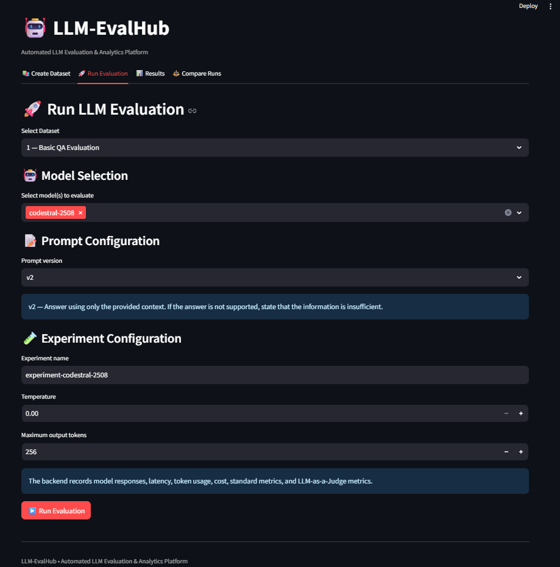
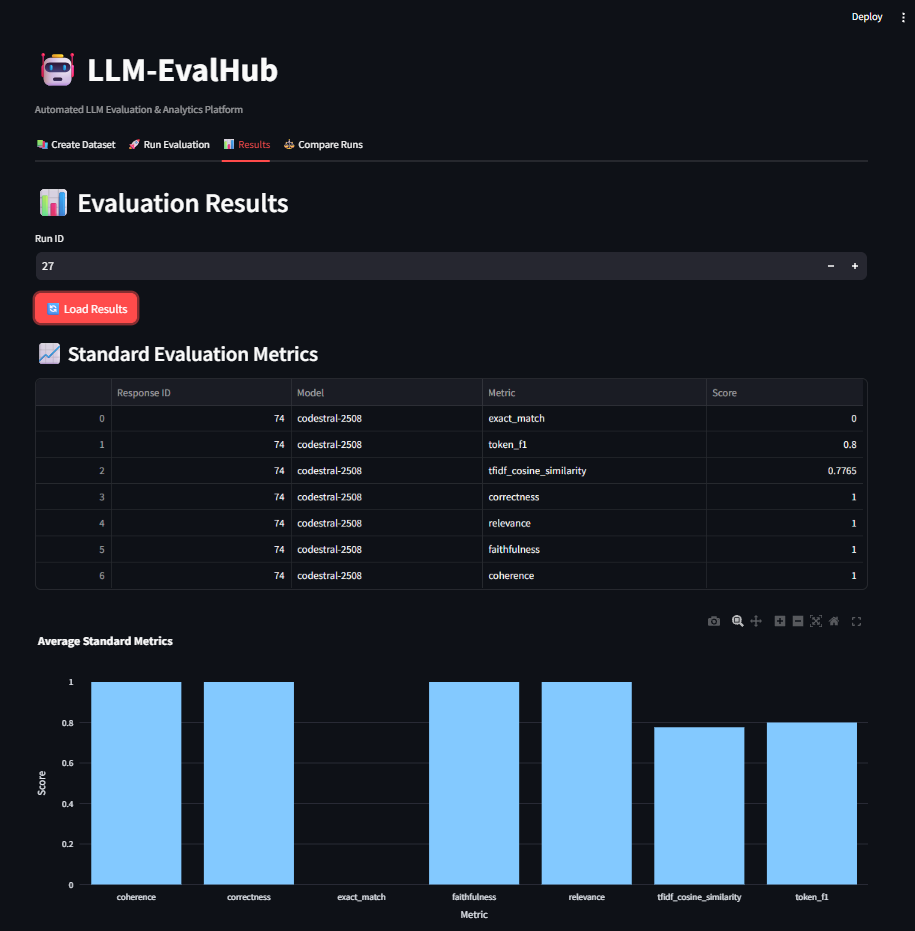
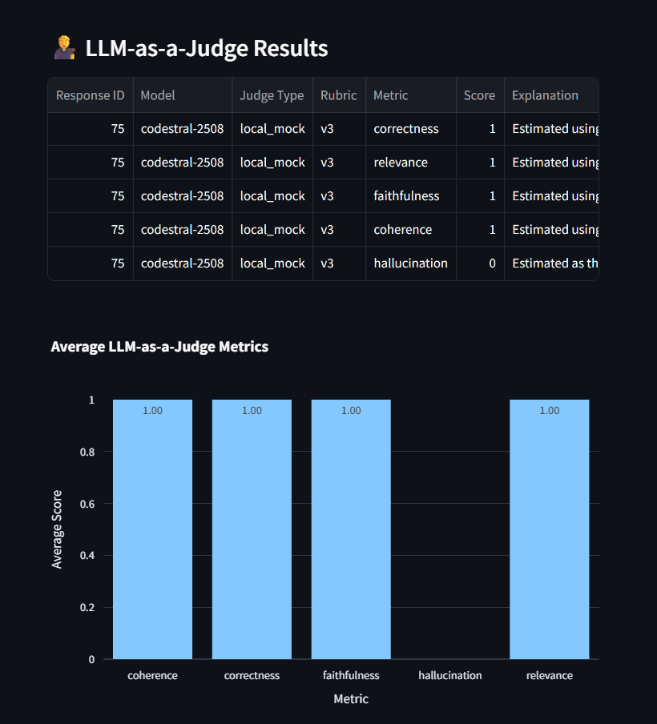
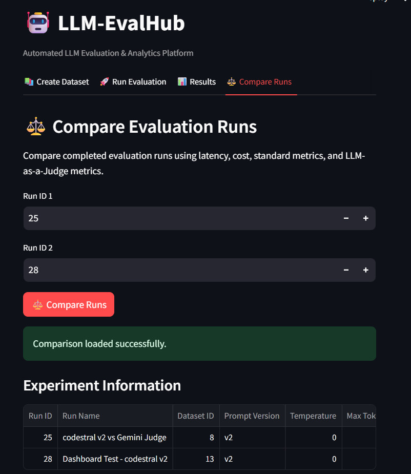

<!-- ========================================================= -->

<!-- 🔥 HEADER -->

<!-- ========================================================= -->

<p align="center">
  
</p>

<h1 align="center">🤖 LLM-EvalHub</h1>

<h3 align="center">
Automated LLM Evaluation & Analytics Platform
</h3>

<p align="center">
  <b>Evaluate Better • Compare Smarter • Build Reliable LLM Applications</b>
</p>

<p align="center">
  
  
  
  
  
  
</p>

<p align="center">
  <a href="https://github.com/NRachana015/llm-evalhub">
    
  </a>
  <a href="https://github.com/NRachana015/llm-evalhub">
    
  </a>
  
</p>

---

# 🧠 Overview

**LLM-EvalHub** is an automated **Large Language Model evaluation and analytics platform** designed to benchmark, analyze, and compare responses generated by different language models.

The platform provides a structured evaluation workflow where users can:

* Create evaluation datasets
* Manage prompt versions
* Run controlled LLM experiments
* Evaluate generated responses using multiple metrics
* Use an **LLM-as-a-Judge** for semantic assessment
* Analyze hallucination signals
* Track response latency and estimated cost
* Record model failures
* Compare evaluation runs through an interactive dashboard

The system follows a complete evaluation lifecycle:

```text
Dataset
   ↓
Prompt Version
   ↓
LLM
   ↓
Generated Response
   ↓
Automated Evaluation
   ↓
LLM-as-a-Judge
   ↓
Analytics
   ↓
Experiment Comparison
```

---

# 🎯 Why LLM-EvalHub?

Generating an answer from an LLM is only one part of building a reliable AI application.

A useful evaluation system should help answer:

```text
Is the response correct?
        ↓
Is it relevant?
        ↓
Is it supported by the context?
        ↓
Does it contain unsupported information?
        ↓
How coherent is the response?
        ↓
How long did generation take?
        ↓
What did the evaluation cost?
        ↓
How does this experiment compare with another?
```

**LLM-EvalHub brings these evaluation stages together into a single experimental platform.**

---

# 🎯 Core Features

| Feature                   | Description                                                         |
| ------------------------- | ------------------------------------------------------------------- |
| 🤖 Multi-LLM Evaluation   | Evaluate responses from different model providers                   |
| 📚 Dataset Management     | Create datasets containing questions, context, and expected outputs |
| 📝 Prompt Versioning      | Run experiments using different prompt versions                     |
| 📊 Automated Evaluation   | Calculate multiple response-quality metrics                         |
| ⚖️ LLM-as-a-Judge         | Perform semantic evaluation using a judge model                     |
| 🚨 Hallucination Analysis | Track hallucination signals from judge evaluations                  |
| ⏱️ Latency Tracking       | Record response generation latency                                  |
| 💰 Cost Estimation        | Estimate model API costs                                            |
| 📈 Experiment Analytics   | Analyze evaluation results through charts and tables                |
| 🔍 Run Comparison         | Compare multiple evaluation experiments                             |
| 🛡️ Failure Handling      | Continue an experiment when individual models fail                  |
| 💾 Persistence            | Store runs, responses, scores, and evaluation metadata              |
| 🌐 REST API               | FastAPI backend for evaluation operations                           |
| 🖥️ Interactive Dashboard | Streamlit interface for running and analyzing experiments           |

---

# 🏗️ System Architecture

```text
                    ┌──────────────────────┐
                    │       Dataset        │
                    │ Questions / Context  │
                    │ Expected Outputs     │
                    └──────────┬───────────┘
                               │
                               ▼
                    ┌──────────────────────┐
                    │  Prompt Management   │
                    │   + Versioning       │
                    └──────────┬───────────┘
                               │
                               ▼
              ┌─────────────────────────────────┐
              │          Multiple LLMs          │
              │                                 │
              │ Gemini │ Codestral │ OpenAI    │
              │ Mistral │ Mock Model            │
              └────────────────┬────────────────┘
                               │
                               ▼
                    ┌──────────────────────┐
                    │  Generated Response  │
                    └──────────┬───────────┘
                               │
                 ┌─────────────┴─────────────┐
                 │                           │
                 ▼                           ▼
        ┌──────────────────┐       ┌──────────────────┐
        │ Automated        │       │ LLM-as-a-Judge   │
        │ Evaluation       │       │ Evaluation       │
        └────────┬─────────┘       └────────┬─────────┘
                 │                          │
                 └─────────────┬────────────┘
                               ▼
                    ┌──────────────────────┐
                    │ Analytics & Metrics  │
                    │ Quality / Latency    │
                    │ Cost / Failures      │
                    └──────────┬───────────┘
                               │
                               ▼
                    ┌──────────────────────┐
                    │ Compare Experiments  │
                    └──────────────────────┘
```

---

# 📊 Evaluation Framework

LLM-EvalHub uses **two complementary evaluation layers**:

* **7 standard automated metrics**
* **5 LLM-as-a-Judge metrics**

These layers provide different signals about generated responses.

---

## 🔹 Standard Automated Metrics

| Metric            | Purpose                                    |
| ----------------- | ------------------------------------------ |
| Exact Match       | Measures exact output agreement            |
| Token F1          | Measures token-level overlap               |
| TF-IDF Similarity | Measures lexical similarity                |
| Correctness       | Evaluates answer correctness               |
| Relevance         | Measures relevance to the question         |
| Faithfulness      | Measures support from the provided context |
| Coherence         | Evaluates response consistency             |

These metrics provide deterministic and reproducible evaluation signals.

---

## 🔹 LLM-as-a-Judge Metrics

The platform additionally uses a judge model for semantic evaluation.

| Metric        | Purpose                                           |
| ------------- | ------------------------------------------------- |
| Correctness   | Determines whether the response answers correctly |
| Relevance     | Evaluates whether the response stays focused      |
| Faithfulness  | Checks whether claims are supported by context    |
| Coherence     | Evaluates logical consistency                     |
| Hallucination | Identifies unsupported information                |

Each judge evaluation can also return an **explanation** alongside the score.

---

# ⚖️ LLM-as-a-Judge

LLM-EvalHub includes a dedicated **LLM-as-a-Judge evaluation layer**.

The current implementation supports a **Gemini-based judge** together with a deterministic local fallback.

```text
Generated Response
        │
        ▼
   Judge Model
        │
        ├── Correctness
        ├── Relevance
        ├── Faithfulness
        ├── Coherence
        └── Hallucination
        │
        ▼
 Score + Explanation
```

### Judge Reliability Tracking

The platform records whether a judge result came from:

```text
🧠 Real LLM Judge
        or
🔧 Local Deterministic Fallback
```

This makes evaluation runs traceable and helps distinguish genuine LLM-based assessments from fallback evaluations.

---

# 🤖 Supported Model Integrations

LLM-EvalHub uses a unified model-routing layer so different model providers can be evaluated through the same pipeline.

### Current Integrations

* Google Gemini
* Mistral / Codestral
* OpenAI API
* Local mock model for testing

The model-routing layer separates provider-specific API calls from the evaluation engine, making additional model integrations easier to add.

---

# 📈 Experiment Analytics

Each evaluation run records important performance and evaluation information.

### Performance Information

* ⏱️ Response latency
* 💰 Estimated API cost
* 🔢 Prompt token usage
* 🔢 Completion token usage
* 📊 Evaluation scores
* ⚠️ Model execution failures

### Run Comparison

Multiple experiments can be compared to analyze changes across:

```text
Run A ─────┐
           │
Run B ─────┼──► Aggregate Analytics
           │
Run C ─────┘

              ├──► Metric Comparison
              ├──► Latency Comparison
              ├──► Cost Comparison
              └──► Judge Metric Comparison
```

This allows experiments using different models, prompts, or configurations to be analyzed within the same platform.

---

# 🛡️ Failure Handling

LLM pipelines can fail because of:

* API quota limits
* unavailable models
* network problems
* provider-side errors
* temporary service failures

LLM-EvalHub handles model failures independently.

```text
Evaluation Run
      │
      ├── Gemini ────── ❌ API Failure
      │
      └── Codestral ─── ✅ Completed
                            │
                            ▼
                     Store Successful
                       Evaluation
```

Instead of terminating the entire experiment when one model fails, the system records:

* Successful models
* Failed models
* Failure status
* Error information
* Completed evaluation results

### Run Statuses

```text
completed
completed_with_errors
failed
```

This makes multi-model experiments more resilient and easier to debug.

---

# 🖥️ Dashboard

The Streamlit dashboard provides an interactive interface for managing and analyzing experiments.

## 📚 Dataset Management

Create evaluation datasets containing:

* Questions
* Context
* Expected outputs
* Categories
* Difficulty levels

---

## 🚀 Evaluation Runner

Configure and execute evaluation runs using:

* Dataset
* Model selection
* Prompt version
* Temperature
* Maximum token configuration

---

## 📊 Results Dashboard

View:

* Standard evaluation metrics
* LLM-as-a-Judge metrics
* Hallucination results
* Latency
* Cost
* Response-level details
* Judge execution information

---

## ⚖️ Compare Runs

Compare completed experiments using:

* Evaluation metrics
* Model performance
* Latency
* Cost
* LLM-as-a-Judge metrics

---

# 📸 Dashboard Preview

## 🚀 Run Evaluation

Configure datasets, models, prompt versions, temperature, and token limits before starting an evaluation run.

<p align="center">
  
</p>

---

## 📈 Evaluation Results

View standard evaluation metrics and LLM-as-a-Judge results through the interactive dashboard.

<p align="center">
  
</p>

---

## 🚨 Hallucination & Judge Analysis

Analyze hallucination signals, judge execution type, rubric versions, and response-level evaluation details.

<p align="center">
  
</p>

---

## ⚖️ Compare Evaluation Runs

Compare different experiments using latency, cost, standard metrics, and LLM-as-a-Judge metrics.

<p align="center">
  
</p>

---

# 🔄 Evaluation Workflow

```text
1. Create Dataset
        ↓
2. Add Questions & Context
        ↓
3. Select Prompt Version
        ↓
4. Select LLM Models
        ↓
5. Execute Evaluation
        ↓
6. Generate Responses
        ↓
7. Calculate Automated Metrics
        ↓
8. Run LLM-as-a-Judge
        ↓
9. Store Scores & Performance
        ↓
10. Analyze Results
        ↓
11. Compare Evaluation Runs
```

---

# 🛠️ Tech Stack

<p align="center">
  
</p>

## 🔹 Backend

* Python 3.12
* FastAPI
* SQLAlchemy
* Pydantic
* Uvicorn

## 🔹 AI / Evaluation

* Google Gemini API
* Mistral / Codestral API
* OpenAI API
* LLM-as-a-Judge
* Scikit-learn
* TF-IDF similarity
* Token-level evaluation

## 🔹 Frontend / Dashboard

* Streamlit
* REST API integration
* Plotly
* Interactive analytics

## 🔹 Database

* SQLite
* SQLAlchemy ORM

## 🔹 Development Tools

* Git
* GitHub
* VS Code
* PowerShell

---

# 📂 Project Structure

```text
llm-eval-dashboard/
│
├── app/
│   ├── __init__.py
│   ├── database.py
│   ├── evaluators.py
│   ├── llm_clients.py
│   ├── llm_judge.py
│   ├── main.py
│   ├── models.py
│   ├── prompt_manager.py
│   └── schemas.py
│
├── prompts/
│   ├── v1.json
│   └── v2.json
│
├── app/screenshots/
│   ├── run-evaluation.png
│   ├── results-overview.png
│   ├── results-details.png
│   └── compare-runs.png
│
├── .env.example
├── .gitignore
├── README.md
├── requirements.txt
├── RUN_LLM_DASHBOARD.bat
├── check_tables.py
├── update_database.py
└── streamlit_app.py
```

---

# 🚀 Getting Started

## 1. Clone the Repository

```bash
git clone https://github.com/NRachana015/llm-evalhub.git
cd llm-evalhub
```

---

## 2. Create a Virtual Environment

### Windows

```powershell
python -m venv venv
.\venv\Scripts\Activate.ps1
```

---

## 3. Install Dependencies

```powershell
pip install -r requirements.txt
```

---

## 4. Configure Environment Variables

Create a `.env` file using `.env.example`.

```text
DATABASE_URL=sqlite:///./eval_dashboard.db

GOOGLE_API_KEY=your_google_api_key
OPENAI_API_KEY=your_openai_api_key
MISTRAL_API_KEY=your_mistral_api_key

JUDGE_MODEL=gemini-3.6-flash
```

Only configure the providers you intend to use.

> ⚠️ Never commit `.env` files or API keys to GitHub.

---

# ▶️ Run the Application

The application uses a FastAPI backend and a Streamlit dashboard.

## Terminal 1 — FastAPI Backend

```powershell
.\venv\Scripts\python.exe -m uvicorn app.main:app --reload --port 8001
```

Backend:

```text
http://127.0.0.1:8001
```

API documentation:

```text
http://127.0.0.1:8001/docs
```

---

## Terminal 2 — Streamlit Dashboard

```powershell
.\venv\Scripts\python.exe -m streamlit run .\streamlit_app.py
```

Dashboard:

```text
http://localhost:8501
```

---

# 🧪 Example Evaluation

A typical experiment can evaluate multiple models using the same dataset and prompt configuration.

```text
Dataset
   │
   ├── Question 1
   ├── Question 2
   └── Question 3
          │
          ▼
      Prompt v2
          │
     ┌────┴─────┐
     ▼          ▼
  Gemini     Codestral
     │          │
     ▼          ▼
 Responses   Responses
     │          │
     └────┬─────┘
          ▼
      Evaluation
          │
    ┌─────┴──────────────┐
    ▼                    ▼
Automated Metrics   LLM-as-a-Judge
    │                    │
    └─────────┬──────────┘
              ▼
       Run Analytics
```

---

# 🔬 Reproducible Evaluation

Evaluation runs store their configuration and results so experiments can be analyzed later.

Tracked experiment information includes:

* Dataset
* Prompt version
* Selected models
* Temperature
* Maximum tokens
* Response outputs
* Evaluation scores
* Judge metadata
* Latency
* Estimated cost
* Model success/failure status

This provides a foundation for controlled LLM benchmarking and experiment tracking.

---

# 🎯 Project Objectives

The project focuses on building practical evaluation infrastructure for modern LLM applications.

### Primary Objectives

* Standardize LLM evaluation
* Compare different model responses
* Evaluate semantic quality
* Detect unsupported information
* Track inference performance
* Monitor estimated API costs
* Preserve experiment history
* Support reproducible evaluation workflows
* Make evaluation results easier to inspect and compare

---

# 🚧 Future Enhancements

Potential future improvements include:

* 📌 Human evaluation workflows
* 📌 Advanced RAG evaluation metrics
* 📌 Context precision and recall
* 📌 Prompt regression testing
* 📌 Evaluation result export
* 📌 Advanced analytics and visualizations
* 📌 Response caching
* 📌 Automated regression detection
* 📌 Authentication and user management
* 📌 PostgreSQL support
* 📌 Docker-based deployment
* 📌 Scheduled evaluation runs

---

# 📌 Project Highlights

```text
✔ Multi-model LLM evaluation

✔ 7 standard automated metrics

✔ 5 LLM-as-a-Judge metrics

✔ Hallucination evaluation

✔ Latency & cost tracking

✔ Prompt versioning

✔ Experiment persistence

✔ Run comparison

✔ Per-model failure handling

✔ FastAPI REST backend

✔ Interactive Streamlit dashboard

✔ Real LLM judge + deterministic fallback
```

---

# 🌐 Repository

<p align="center">

<a href="https://github.com/NRachana015/llm-evalhub">

</a>

</p>

<p align="center">
  <a href="https://github.com/NRachana015/llm-evalhub">
    View the complete source code →
  </a>
</p>

---

# 📜 License

This project is licensed under the **MIT License**.

---

# 👩‍💻 Author

<p align="center">

<b>Rachana Nyavanandhi</b>

<br>

B.Tech — Artificial Intelligence & Machine Learning

<br><br>

<a href="https://github.com/NRachana015">

</a>

</p>

---

<p align="center">

<b>Evaluate Better • Compare Smarter • Build Reliable LLM Applications 🚀</b>

</p>

<p align="center">
Built as a practical AI/ML engineering project focused on LLM evaluation, experimentation, and analytics.
</p>
