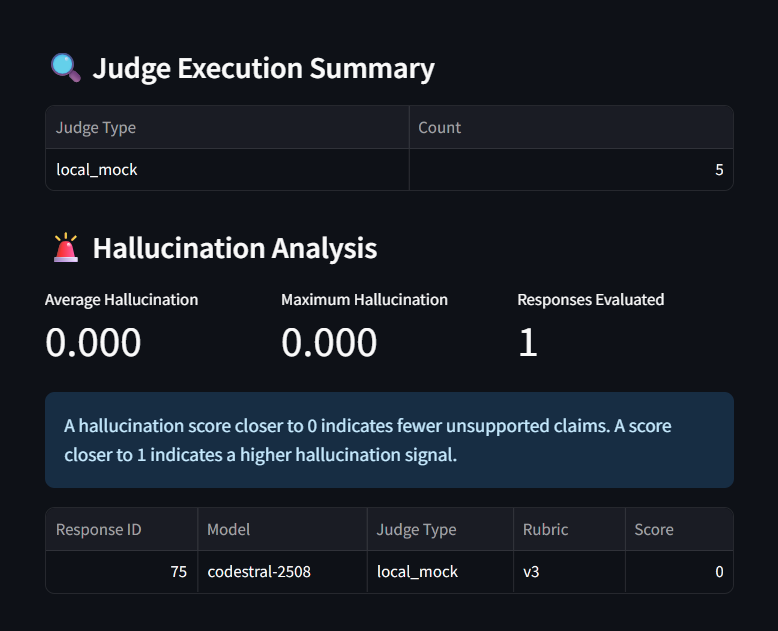
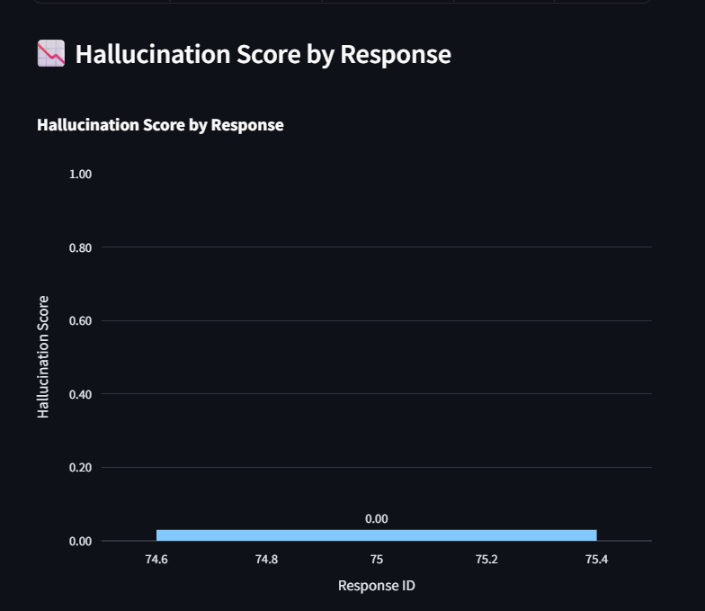
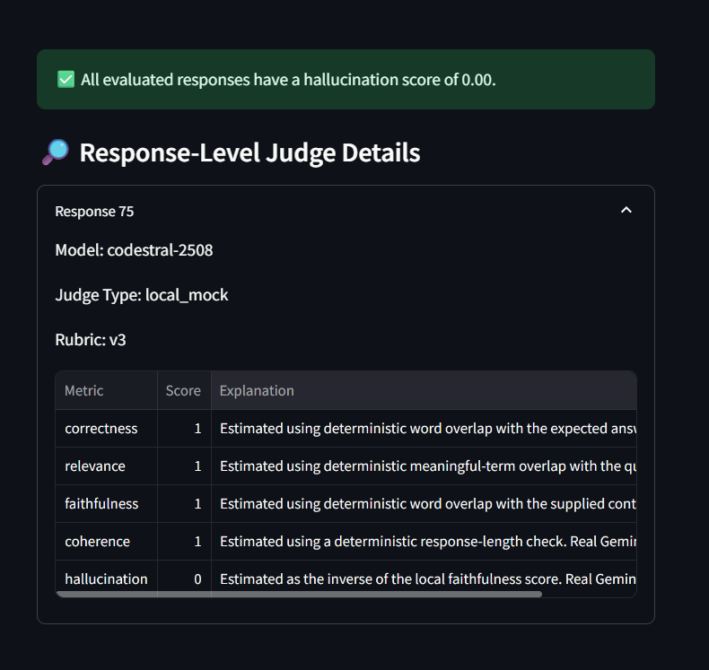
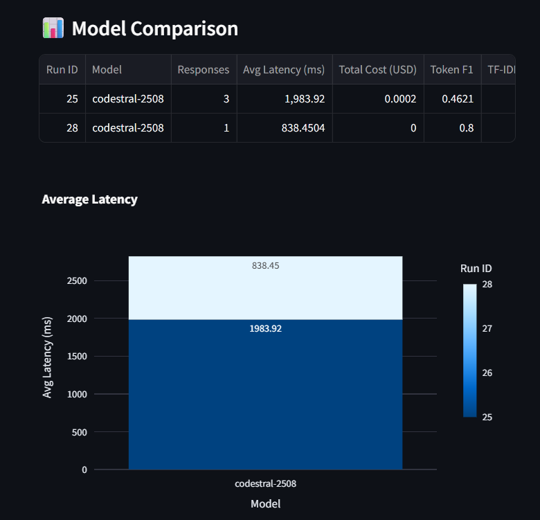
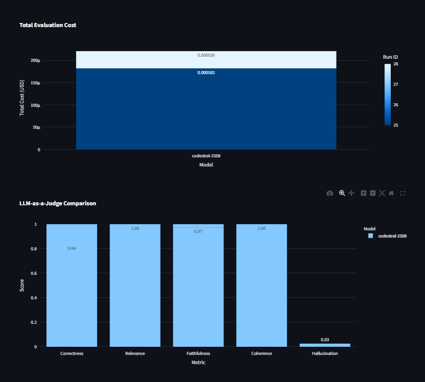

# 🤖 LLM-EvalHub

### Automated LLM Evaluation & Analytics Platform

<p align="center">

<b>Evaluate. Compare. Diagnose. Improve.</b><br>

A production-oriented platform for systematically evaluating Large Language Model responses across quality, RAG, hallucination, latency, cost, and LLM-as-Judge dimensions.

</p>

<p align="center">


</p>

---

## 📌 Overview

**LLM-EvalHub** is an automated evaluation and analytics platform designed to measure how well Large Language Models perform under controlled experimental conditions.

Instead of simply generating an answer and judging it manually, the platform creates a repeatable evaluation workflow:

```text
Dataset
   ↓
Prompt Version
   ↓
LLM Generation
   ↓
Automated Evaluation
   ↓
LLM-as-a-Judge
   ↓
Failure & Hallucination Analysis
   ↓
Metrics + Cost + Latency
   ↓
Experiment Comparison
   ↓
Interactive Dashboard
```

The platform is built around a simple engineering principle:

> **LLM outputs should be measurable, reproducible, and comparable.**

---

## 🎯 Why LLM-EvalHub?

Modern LLM applications require more than checking whether a response "looks good."

A useful evaluation system should answer questions such as:

* Is the generated answer correct?
* Is it relevant to the question?
* Is it faithful to the supplied context?
* Does it contain unsupported information?
* How coherent is the response?
* How long did generation take?
* How much did the request cost?
* How does one model compare with another?
* What happens when an LLM provider fails?
* Can the evaluation be reproduced later?

**LLM-EvalHub brings these requirements together into one evaluation workflow.**

---

# ✨ Key Capabilities

### 🧪 Multi-Dimensional Evaluation

Evaluates generated responses using:

* Exact Match
* Token F1
* TF-IDF Cosine Similarity
* Correctness
* Relevance
* Faithfulness
* Coherence

### ⚖️ LLM-as-a-Judge

Uses a separate evaluation layer to assess:

* Correctness
* Relevance
* Faithfulness
* Coherence
* Hallucination

Each judge result can include an explanation, making the evaluation more interpretable.

### 🔀 Multi-Model Evaluation

The architecture supports multiple LLM providers/models, including:

* `gpt-4o-mini`
* `gemini-3.6-flash`
* `mistral-small-latest`
* `codestral-2508`
* `mock-model`

### 📊 Experiment Analytics

Tracks:

* Response latency
* Prompt tokens
* Completion tokens
* Estimated cost
* Success/failure status
* Evaluation scores
* Judge scores

### 🛡️ Failure Handling

The system records model failures and supports deterministic local fallback for judge evaluation when external judge services are unavailable.

### 📈 Run Comparison

Compare multiple evaluation runs to study differences between:

* Models
* Prompt versions
* Experiments
* Evaluation results

### 🖥️ Interactive Dashboard

A Streamlit dashboard provides dedicated workflows for:

* Dataset creation
* Evaluation execution
* Results inspection
* Run comparison
* Metric visualization
* Hallucination analysis

---

# 🏗️ System Architecture

```text
                    ┌─────────────────────┐
                    │      DATASETS       │
                    │ Questions + Context │
                    └──────────┬──────────┘
                               │
                               ▼
                    ┌─────────────────────┐
                    │   PROMPT MANAGER    │
                    │   Versioning v1/v2  │
                    └──────────┬──────────┘
                               │
                               ▼
                    ┌─────────────────────┐
                    │    LLM CLIENTS      │
                    │ Multiple Providers  │
                    └──────────┬──────────┘
                               │
                               ▼
              ┌────────────────────────────────┐
              │       EVALUATION ENGINE         │
              │                                │
              │  Exact Match                   │
              │  Token F1                      │
              │  TF-IDF Similarity             │
              │  Correctness                   │
              │  Relevance                     │
              │  Faithfulness                  │
              │  Coherence                     │
              └───────────────┬────────────────┘
                              │
                              ▼
                    ┌─────────────────────┐
                    │   LLM-AS-A-JUDGE    │
                    │                     │
                    │ Correctness         │
                    │ Relevance           │
                    │ Faithfulness        │
                    │ Coherence           │
                    │ Hallucination       │
                    └──────────┬──────────┘
                               │
                               ▼
                    ┌─────────────────────┐
                    │   EXPERIMENT DB     │
                    │       SQLite        │
                    └──────────┬──────────┘
                               │
                               ▼
                    ┌─────────────────────┐
                    │   FASTAPI BACKEND   │
                    └──────────┬──────────┘
                               │
                               ▼
                    ┌─────────────────────┐
                    │ STREAMLIT DASHBOARD │
                    │ Analytics + Compare │
                    └─────────────────────┘
```

---

# 🔬 Evaluation Framework

LLM-EvalHub combines deterministic metrics with semantic evaluation.

## Standard Metrics

| Metric                       | Purpose                                                             |
| ---------------------------- | ------------------------------------------------------------------- |
| **Exact Match**              | Measures whether generated and expected answers match exactly       |
| **Token F1**                 | Measures token-level overlap between generated and expected answers |
| **TF-IDF Cosine Similarity** | Measures lexical similarity using vector representations            |
| **Correctness**              | Evaluates whether the answer is factually correct                   |
| **Relevance**                | Measures how directly the response addresses the question           |
| **Faithfulness**             | Measures whether claims are supported by the provided context       |
| **Coherence**                | Measures clarity and logical consistency                            |

## Judge Metrics

| Metric            | Purpose                                              |
| ----------------- | ---------------------------------------------------- |
| **Correctness**   | Is the answer accurate?                              |
| **Relevance**     | Does it answer the question appropriately?           |
| **Faithfulness**  | Is it grounded in the provided context?              |
| **Coherence**     | Is the response logically understandable?            |
| **Hallucination** | Does the response introduce unsupported information? |

---

# ⚖️ LLM-as-a-Judge

LLM-EvalHub includes an **LLM-as-a-Judge** evaluation layer for semantic assessment.

The judge receives:

```text
Question
   +
Context
   +
Expected Answer
   +
Generated Answer
```

and produces structured evaluation results.

The current judge rubric is:

```text
Rubric Version: v3

Correctness
Relevance
Faithfulness
Coherence
Hallucination
```

Each metric can also contain an explanation describing the basis of the evaluation.

### Fallback Strategy

External LLM judge services may become unavailable because of:

* API quota limits
* Provider errors
* Temporary service failures
* Network/API availability

LLM-EvalHub therefore supports a deterministic local fallback.

The system records whether a judge result came from:

```text
llm
local_mock
mixed
```

This allows failures to remain visible rather than silently disappearing.

---

# 🤖 Supported Model Integrations

The model router provides a unified interface for supported providers.

| Model                  | Provider | Role                   |
| ---------------------- | -------- | ---------------------- |
| `gpt-4o-mini`          | OpenAI   | LLM generation         |
| `gemini-3.6-flash`     | Google   | LLM generation / judge |
| `mistral-small-latest` | Mistral  | LLM generation         |
| `codestral-2508`       | Mistral  | LLM generation         |
| `mock-model`           | Local    | Deterministic testing  |

The abstraction makes it possible to evaluate different models without changing the core evaluation pipeline.

---

# 📊 Experiment Analytics

Every evaluation run stores important experiment metadata.

### Run-Level Data

* Run name
* Dataset
* Prompt version
* Temperature
* Maximum tokens
* Timestamp
* Completion status

### Response-Level Data

* Model name
* Generated response
* Latency
* Prompt tokens
* Completion tokens
* Estimated cost
* Status
* Error message

### Evaluation-Level Data

* Standard metric scores
* Judge scores
* Judge type
* Rubric version
* Judge explanations

This structure allows results to be analyzed after the original experiment has completed.

---

# 🖥️ Interactive Dashboard

The Streamlit interface is organized into four workflows:

### 1. Create Dataset

Create evaluation datasets containing questions, context, expected answers, categories, and difficulty levels.

### 2. Run Evaluation

Select:

* Dataset
* Models
* Prompt version
* Temperature
* Maximum tokens

and launch an evaluation experiment.

### 3. Results

Inspect:

* Run metadata
* Model responses
* Standard metrics
* Judge metrics
* Latency
* Cost
* Hallucination analysis

### 4. Compare Runs

Compare multiple completed runs to identify differences across experiments.

---

# 📸 Dashboard Preview

## Run Evaluation


## Results Overview


## Detailed Results








## Compare Runs






---

# 🔄 Evaluation Workflow

A complete evaluation follows this sequence:

```text
1. Create Dataset
       ↓
2. Select Prompt Version
       ↓
3. Select LLM Model(s)
       ↓
4. Generate Responses
       ↓
5. Record Latency / Tokens / Cost
       ↓
6. Calculate Standard Metrics
       ↓
7. Run LLM-as-a-Judge
       ↓
8. Apply Local Fallback if Required
       ↓
9. Store Results in SQLite
       ↓
10. Analyze Through Dashboard
       ↓
11. Compare Experiments
```

---

# 🧪 Automated Testing

LLM-EvalHub includes a dedicated automated test suite covering the core system.

### Test Results

```text
35 passed
1 dependency warning
5.75 seconds
```

### Test Breakdown

| Test Area   |  Tests | Result      |
| ----------- | -----: | ----------- |
| API         |     11 | ✅ 11/11     |
| Evaluators  |      7 | ✅ 7/7       |
| LLM Clients |      5 | ✅ 5/5       |
| LLM Judge   |      5 | ✅ 5/5       |
| Schemas     |      7 | ✅ 7/7       |
| **Total**   | **35** | **✅ 35/35** |

The test suite verifies:

* API behavior
* Request/response schemas
* Evaluation metrics
* Model client routing
* Judge behavior
* Fallback behavior
* Validation logic

Tests use the deterministic `mock-model` where external API calls are unnecessary, keeping automated testing reproducible and independent of provider quotas.

---

# 🛡️ Reliability & Failure Handling

A major design goal of the project is to make failures observable.

Instead of treating an API failure as an invisible error, the platform records:

```text
Model
Status
Error Message
Run Completion State
Successful Models
Failed Models
Fallback Usage
```

This allows a run to communicate states such as:

```text
completed
completed_with_errors
```

The result is a more realistic evaluation workflow for environments where external LLM APIs can fail or become rate-limited.

---

# 🗄️ Data Persistence

The application uses **SQLite + SQLAlchemy** for experiment persistence.

The database stores relationships between:

```text
Dataset
   ↓
Prompt
   ↓
Run
   ↓
Response
   ↓
Standard Scores
   ↓
Judge Scores
```

This enables historical experiment analysis rather than treating every evaluation as a temporary API request.

---

# 🧩 Project Structure

```text
llm-evalhub/
│
├── app/
│   ├── database.py
│   ├── evaluators.py
│   ├── llm_clients.py
│   ├── llm_judge.py
│   ├── main.py
│   ├── models.py
│   ├── prompt_manager.py
│   ├── schemas.py
│   ├── __init__.py
│   │
│   └── screenshots/
│       ├── compare-runs.png
│       ├── compare-runs01.png
│       ├── compare-runs02.png
│       ├── results-details01.png
│       ├── results-details02.png
│       ├── results-details03.png
│       ├── results-details04.png
│       ├── results-overview.png
│       └── run-evaluation.png
│
├── tests/
│   ├── test_api.py
│   ├── test_evaluators.py
│   ├── test_llm_clients.py
│   ├── test_llm_judge.py
│   ├── test_schemas.py
│   └── __init__.py
│
├── prompts/
│   ├── v1.json
│   └── v2.json
│
├── streamlit_app.py
├── requirements.txt
├── .env.example
├── .gitignore
├── RUN_LLM_DASHBOARD.bat
├── check_tables.py
└── README.md
```

---

# 🛠️ Technology Stack

### Backend

* Python
* FastAPI
* SQLAlchemy
* Pydantic

### LLM Integration

* OpenAI API
* Google Gemini API
* Mistral API

### Evaluation

* Custom deterministic metrics
* TF-IDF similarity
* LLM-as-a-Judge
* Local deterministic fallback

### Frontend

* Streamlit
* Plotly
* Pandas

### Database

* SQLite
* SQLAlchemy ORM

### Testing

* Pytest

### Development

* VS Code
* Git
* GitHub

---

# ⚙️ Getting Started

## 1. Clone the Repository

```bash
git clone https://github.com/NRachana015/llm-evalhub.git
cd llm-evalhub
```

## 2. Create Virtual Environment

```bash
python -m venv venv
```

### Windows

```powershell
.\venv\Scripts\Activate.ps1
```

## 3. Install Dependencies

```bash
pip install -r requirements.txt
```

## 4. Configure Environment Variables

Create a `.env` file based on:

```text
.env.example
```

Add the required API keys for the providers you want to use.

> 🔐 **Security:** Never commit the `.env` file or expose API keys in source code, screenshots, documentation, or public repositories.

---

# ▶️ Run the Application

## Start FastAPI Backend

```powershell
.\venv\Scripts\python.exe -m uvicorn app.main:app --reload --port 8001
```

Backend:

```text
http://127.0.0.1:8001
```

Swagger API documentation:

```text
http://127.0.0.1:8001/docs
```

## Start Streamlit Dashboard

Open another terminal:

```powershell
.\venv\Scripts\python.exe -m streamlit run .\streamlit_app.py
```

Dashboard:

```text
http://localhost:8501
```

---

# 🧪 Run Tests

Run the complete test suite:

```powershell
.\venv\Scripts\python.exe -m pytest -v
```

Expected result:

```text
35 passed
```

---

# 📋 Example Evaluation

A typical experiment can be configured as:

```text
Dataset:
Model Comparison Benchmark

Models:
codestral-2508
gemini-3.6-flash

Prompt:
v2

Temperature:
0.0

Max Tokens:
256
```

The platform then generates responses and calculates:

```text
Standard Metrics
        +
Judge Metrics
        +
Latency
        +
Token Usage
        +
Estimated Cost
        +
Failure Status
```

The complete result becomes available through the dashboard.

---

# 🔁 Reproducible Evaluation

LLM evaluation can vary significantly depending on configuration.

LLM-EvalHub therefore records important experiment parameters including:

* Dataset
* Prompt version
* Model
* Temperature
* Maximum tokens
* Evaluation metrics
* Judge rubric version
* Model response
* Evaluation results
* Timestamp

This creates a traceable experiment history and makes model/prompt comparisons more meaningful.

---

# 💡 Engineering Design Principles

### 1. Separation of Concerns

The system separates:

```text
API
Database
LLM Clients
Evaluation
Judge
Dashboard
Testing
```

### 2. Provider Abstraction

Different LLM providers are accessed through a unified client interface.

### 3. Observable Failures

Provider errors and fallback behavior are stored rather than hidden.

### 4. Reproducibility

Evaluation configuration and results are persisted.

### 5. Testability

External LLM dependencies are isolated from deterministic unit tests.

### 6. Extensibility

New:

* Models
* Metrics
* Prompt versions
* Judge rubrics
* Analytics

can be added without redesigning the complete application.

---

# 📈 Representative Experiment Snapshot

One completed experiment using `codestral-2508` produced:

```text
Average Latency       ≈ 1.98 seconds
Average Cost          ≈ $0.0000607
Total Cost            ≈ $0.0001821

Token F1              ≈ 0.462
TF-IDF Similarity     ≈ 0.372

Correctness           ≈ 0.838
Relevance             = 1.000
Faithfulness          ≈ 0.974
Coherence             = 1.000

Hallucination         ≈ 0.026
```

These values demonstrate how the platform combines **quality, semantic evaluation, hallucination analysis, latency, and cost** within the same experiment record.

> Experimental values depend on the selected dataset, model, prompt, provider availability, and evaluation configuration.

---

# 🚧 Future Enhancements

Potential future extensions include:

* 📦 Docker deployment
* ☁️ Cloud-hosted dashboard
* 🗃️ PostgreSQL support
* 📊 Advanced experiment analytics
* 📉 Historical metric trends
* 🧠 Additional judge models
* 🔍 More hallucination detection methods
* 📤 CSV/JSON report export
* 🔐 Authentication and user management
* 📡 Continuous evaluation pipelines
* 🔄 CI/CD-based automated evaluation

---

# 🌟 Project Highlights

```text
┌──────────────────────────────────────────┐
│              LLM-EvalHub                 │
├──────────────────────────────────────────┤
│                                          │
│  ✓ Multi-LLM Evaluation                 │
│  ✓ 7 Standard Metrics                   │
│  ✓ 5 LLM-Judge Metrics                  │
│  ✓ Hallucination Analysis               │
│  ✓ Prompt Versioning                    │
│  ✓ Latency Tracking                     │
│  ✓ Token & Cost Tracking                │
│  ✓ Failure & Fallback Handling          │
│  ✓ Experiment Persistence               │
│  ✓ Run Comparison                       │
│  ✓ Interactive Dashboard                │
│  ✓ Automated Test Suite                │
│  ✓ 35/35 Tests Passing                  │
│                                          │
└──────────────────────────────────────────┘
```

---

# 🎓 What This Project Demonstrates

LLM-EvalHub demonstrates practical engineering across several areas of modern AI systems:

### Artificial Intelligence

* Large Language Models
* LLM evaluation
* LLM-as-a-Judge
* Hallucination analysis

### Machine Learning / NLP

* Token-level evaluation
* TF-IDF representations
* Semantic response evaluation

### Software Engineering

* REST API development
* Database modeling
* Provider abstraction
* Error handling
* Modular architecture

### Data & Analytics

* Experiment tracking
* Metric aggregation
* Cost analysis
* Latency analysis
* Run comparison

### Testing

* Unit testing
* API testing
* Schema validation
* Deterministic mock testing

### Product Engineering

* Interactive dashboard
* Experiment workflow
* Observability
* Reproducibility

---

# 🏆 Why LLM-EvalHub Is Different

Many LLM projects focus primarily on:

```text
Prompt → LLM → Answer
```

LLM-EvalHub focuses on what happens **after the answer is generated**:

```text
Prompt
  ↓
LLM
  ↓
Response
  ↓
Measure Quality
  ↓
Measure Grounding
  ↓
Detect Hallucination
  ↓
Track Latency
  ↓
Track Cost
  ↓
Judge Semantically
  ↓
Store Experiment
  ↓
Compare Results
```

This transforms LLM interaction into a **measurable evaluation workflow**.

---

# 📌 Project Status

**Status: Completed Core Implementation ✅**

The current implementation includes:

* Working FastAPI backend
* Working Streamlit dashboard
* Multi-model routing
* Automated evaluation
* LLM-as-a-Judge
* Local judge fallback
* Experiment persistence
* Run comparison
* Failure tracking
* Automated testing
* Professional documentation

Current automated test status:

```text
35 / 35 tests passing ✅
```

---

# 🔗 Repository

<p align="center">

### ⭐ LLM-EvalHub

**Automated LLM Evaluation & Analytics Platform**

[View Repository](https://github.com/NRachana015/llm-evalhub)

</p>

---

# 👩‍💻 Author & Connect

**Rachana Nyavanandhi**

B.Tech — Artificial Intelligence & Machine Learning

### 🔗 Connect

* **GitHub:** https://github.com/NRachana015
* **Project Repository:** https://github.com/NRachana015/llm-evalhub

---

<p align="center">

⭐ **If you find LLM-EvalHub useful, consider starring the repository.**

<br><br>

### 🤖 LLM-EvalHub

**Evaluate. Compare. Diagnose. Improve.**

</p>
